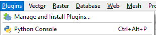
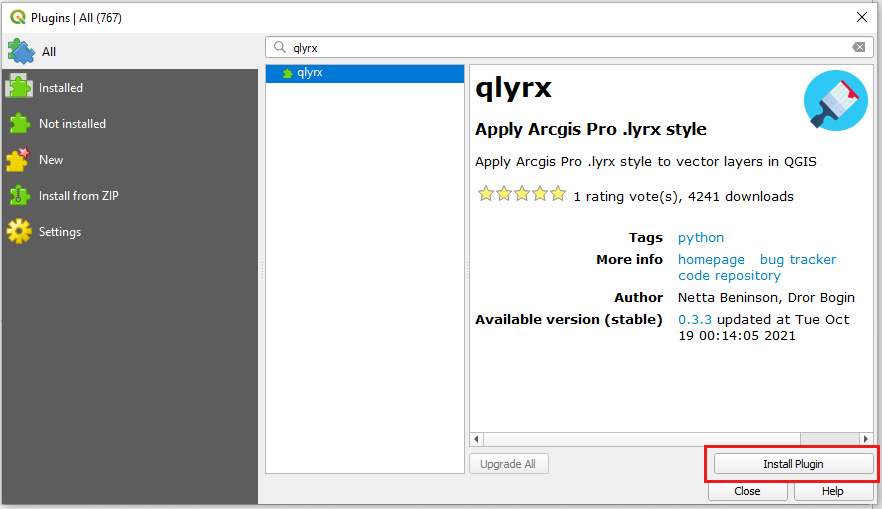

# qlyrx

### This project enables using ArcGIS Pro symbology files (.lyrx) directly in QGIS.

Important note: Esri’s former symbology format (*.lyr) is not supported.  
It is possible to generate a *.lyrx file by opening and saving your *.lyr file in ArcGIS Pro.

The plugin was built and tested on Windows using QGIS >= 3.4  
Tested on Ubuntu 18.04 as well.  

* Not all symbology types are currently supported, if something is missing please open an [issue](https://github.com/arc2qgis/qlyrx/issues)

### Installation

 You can install  **qlyrx** directly through the QGIS plugin manager, simply open **Plugins** -> *Manage and Install Plugins..*  
   
 Then search for **qlyrx** and click on *Install Plugin*  
   
 
 You can also install the latest release if you download the [qlyrx.zip](https://github.com/arc2qgis/qlyrx/releases) file from GitHub and install the plugin using the [**install from zip**](https://docs.qgis.org/testing/en/docs/user_manual/plugins/plugins.html#the-install-from-zip-tab) method within the QGIS plugin manager.  

### Functionality
- The plugin currently supports lyrx files with:  
   - Unique Values symbologies (1 or 2 fields classification) => QGIS Categorized 
   - Simple renderers  

- Esri/Qgis main conversions:  
    - CIMSolidFill  => QgsSymbol.defaultSymbol
    - CIMSolidStroke (=> QgsSimpleLineSymbolLayer or base symbol stroke)  
    - CIMHatchFill => QgsLinePatternFillSymbolLayer  
    - CIMCharacterMarker => QgsFontMarkerSymbolLayer w QgsPointPatternFillSymbolLayer or QgsMarkerLineSymbolLayer  
    - CIMGeometricEffectDashes => setCustomDashVector  
    - CIMPictureFill - creates svg from base64 image string  
    - CIMVectorMarker  
      - CIMCharacterMarker collection  
					or  
      - Use predefined shapes QgsSimpleMarkerSymbolLayer w QgsMarkerLineSymbolLayer  
				[Esri predefined shapes uses 'paths' WIP]  
- Known issues:  
   - QGIS does not offer support for grouping categories  
   - SVG base64 image fill is generated as black and white image  
   - Converting CIMVectorMarker from shape paths arrays to QGIS shapes is a customized tweak
   - Some lyrx symbology uses Esri's or extrnal **fonts**, without it, QGIS will fall back to a default font 
   - Problem in converting complex CIMVectorMarker properties
   - Symbol 'halo' is not supported in QGIS (our tweak is to duplicate and enlarge the bottom most symbol, problem when using with different symbol shapes)
- Next:  
   - Graduated symbology support  
   - Labels support  
  

    

We recommend saving your styles, after creating the new symbology with the plugin as qgis native *.sld/*.qml formats

To use the plugin select a *.lyrx* file and the layer it should style.

### Converting .lyr to .lyrx

You can find a python script that converts all .lyr files to .lyrx within a directory (and all of its subdirectories) [here](https://github.com/arc2qgis/lyrxtoqml/blob/master/bulk_lyr_convert.py).  
note that you need the computer this runs on to have ArcGIS Pro - arcpy pro installed.

This plugin is provided under the [*GPL2 License*](LICENSE)
